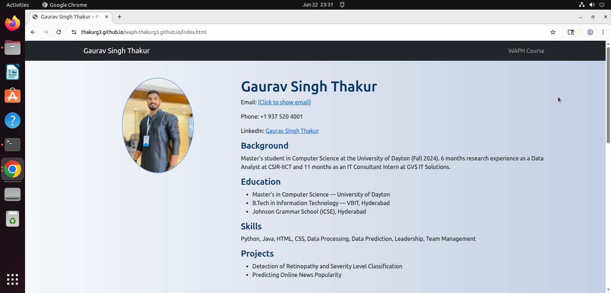
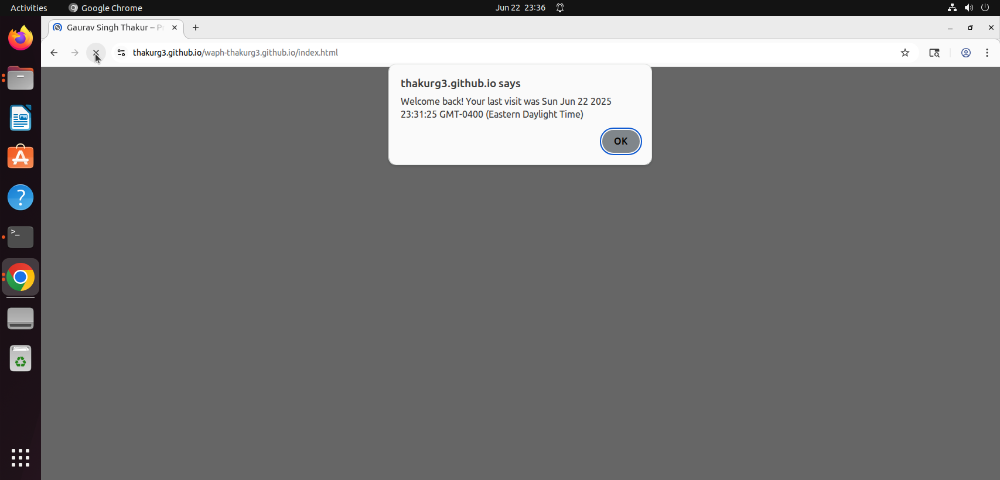
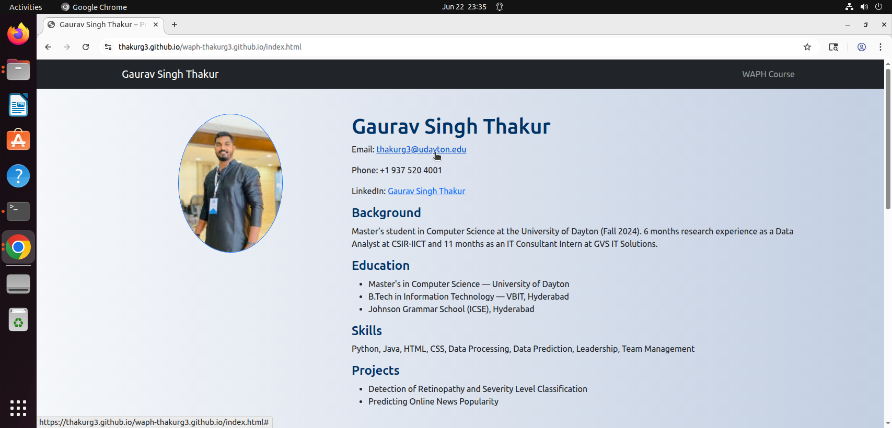
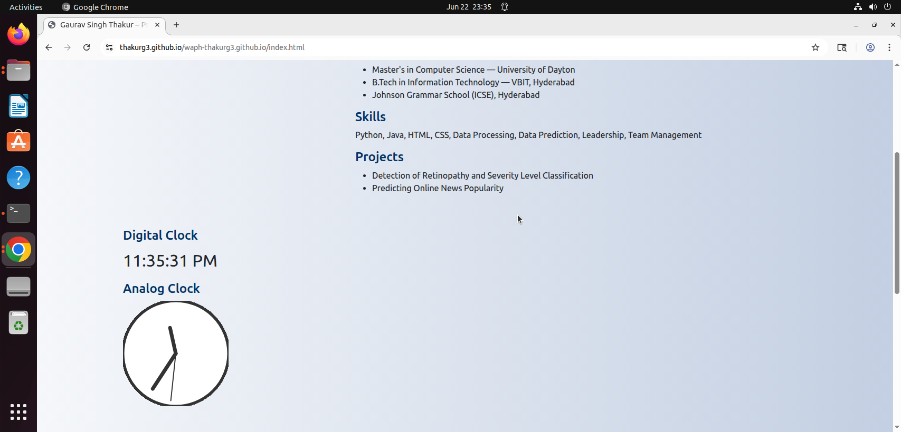
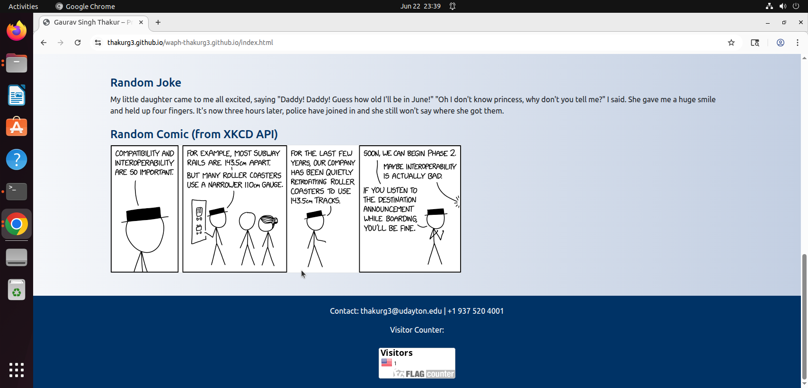
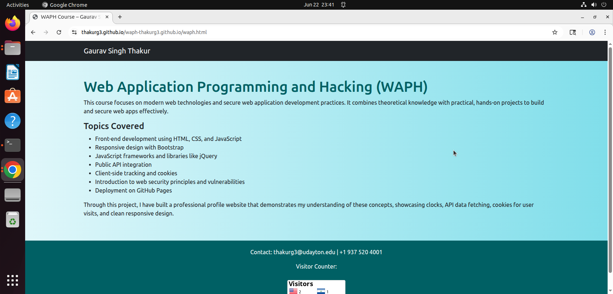
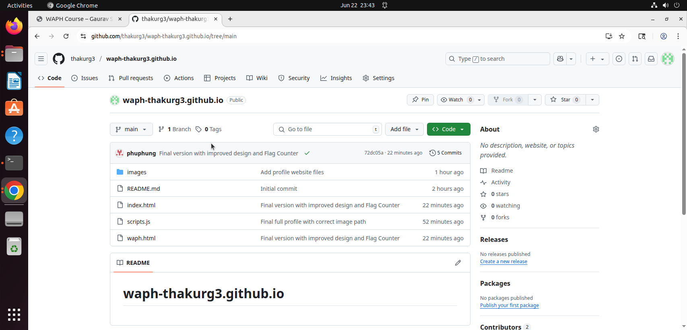

# waph-thakurg3.github.io

# WAPH Individual Project 1  
**Course:** Web Application Programming and Hacking (WAPH)  
**Instructor:** Dr. Phu Phung  
**Student:** Gaurav Singh Thakur — thakurg3@udayton.edu  
## URLs  
- **Website:** [https://thakurg3.github.io/waph-thakurg3.github.io/](https://thakurg3.github.io/waph-thakurg3.github.io/)
- **GitHub Repo:** [https://github.com/thakurg3/waph-thakurg3.github.io](https://github.com/thakurg3/waph-thakurg3.github.io)

---

## Overview  
In this project, I developed a **Professional Profile Website** using modern front-end web technologies and deployed it using **GitHub Pages**. The website includes my profile, resume details, contact information, JavaScript features (digital & analog clocks, show/hide email), API integrations (jokes and XKCD comics), cookies for visit tracking, and a visitor tracker.

**Deployed URL:** [https://thakurg3.github.io/waph-thakurg3.github.io/](https://thakurg3.github.io/waph-thakurg3.github.io/)  
**GitHub Repository:** [https://github.com/thakurg3/waph-thakurg3.github.io](https://github.com/thakurg3/waph-thakurg3.github.io)

---

## Tasks and How I Completed Them

### **Profile Page**
- Used **Bootstrap** for responsive design.
- Added my **name, headshot, contact email, phone, LinkedIn, education, skills, and projects**.

###  **JavaScript Functionality**
- **Digital Clock** — updates every second.
- **Analog Clock** — uses Canvas API.
- **Show/Hide Email** — shows my real email when clicked.
- **Cookies** — displays a welcome message for first-time or returning visitors.

### **API Integrations**
- **JokeAPI:** Loads a new joke every minute.
- **XKCD Comic API:** Shows a latest random comic.

### **WAPH Page**
- Created a separate page with details about the course, topics covered, and skills learned.

###  **Visitor Tracker**
- Added a **Flag Counter** to count site visits.

### **Deployment**
- Hosted on **GitHub Pages** under my custom URL.

---

## Conclusion  
This project strengthened my practical skills in **HTML, CSS, Bootstrap, JavaScript, jQuery, API usage, cookies, and deployment**. It gave me hands-on experience building a professional portfolio website for real-world applications.

---

